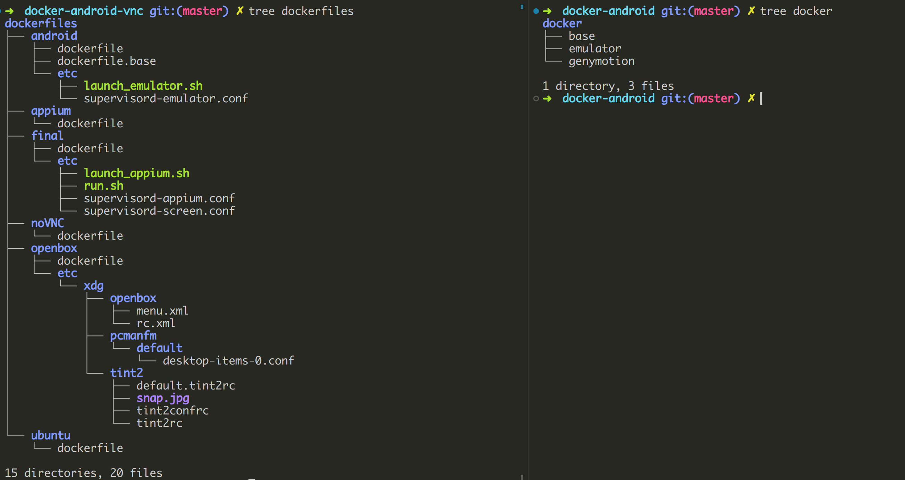
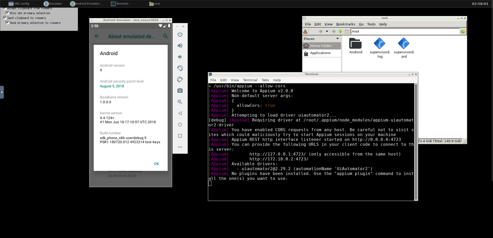

## purpose:

I use the code provided by [budtmo](https://github.com/budtmo/docker-android) in the past, it is fast and efficient.
At one day it doesn't work, no matter how i get the source from github directly or put my tiny effort to troubleshoot those code.
That why i need to re-invent the wheel.

## structure

docker (qemu, kvm)
vnc
openbox
android emulator
appium

## highlight

Configurations (i.e. ANDROID_API, SCREEN RESOLUTION) were saved in the docker-compose.yml, no need to separate the configuration.
appium included per android emulator
Similar to the budtmo's but just lighter and more intrusive.

## difficulty

the code is now mine ~

## repository:

git@github.com:louiscklaw/docker-android-vnc.git

## journals

whole process around 3 days

first day: Identify the problem.
The one from budtmo's were not working. after a shallow drill down it still doesn't work.
as the complexity of the code is much more over my need. so i decide to re-write myself.

by understnad the code, the mechanism gained:
docker to organize the process and project.
after container start. a little python script will parse the configuration and setup facilities. (complicated !)
the build steps of the dockerfiles mixed and difficult to tier down.

second day:
I make a several try to run the sdkmanager/avdmanager instead of running android studio at first. hope that is the shortcut to save my time. however it doesn't work, better luck next time.

Then i try again from ground up, the android studio.

the android studio is packed be google as a whole. it mean to be able to run itself without problem.

however it still doesn't work, the problem narrow down to the environment.

have a look into the android studio (getting started). every steps followed and installed.

putting a search into google. turn out the qemu-kvm-i386 need to be installed.

finally the emulator inside android studio work. the environment is validated to be work with the emulator.

follow the steps by android sdk documentation and now cmdtools works.

At the very first stage. i have problem with running emulator inside docker.
i will follow the structure(maintain/maximize the possibility to copy) from budtmos but just try to keep my stuff tidy.

the original image can be executed in different environments (even amzn s3) which is much over my need. so i ignore it.

the qemu-kvm-i386 is the culprit found during the troubleshooting

the supervisord is a good tools to manage the process. although i think it is kind of breaking the atomicity from docker principle.
it provides some good feature (i.e. autorestart) to monitor process and make the container be a tiny vm.

openbox installation
vnc installation
android installation
appium installation

separated into 2 parts:
base image:
containes vnc, appium, opebox etc.
android sdk image:
overlay to the base-image and change the android sdk version only

### screenshot:

the one on the left looks complicated but function by its name.
the one on the right means mixin to me

the build steps are different. the one on the left should be built by ./build.sh and run by docker-compose (by its design).

the docker build will cache the steps/files when execute.
however to maximize the cache capabilities. the seperated `dockerfile` can prevent docker build again while using cached version. also the component can be "switch-off" from the script making it easier to test. the one on the left is easier to manage. (by arrange the build steps in bash file)

budtmo image doesn't work
placeholder

### references:

- [https://github.com/budtmo/docker-android](https://github.com/budtmo/docker-android)
- [https://github.com/Deadolus/android-studio-docker.git](https://github.com/Deadolus/android-studio-docker.git)
