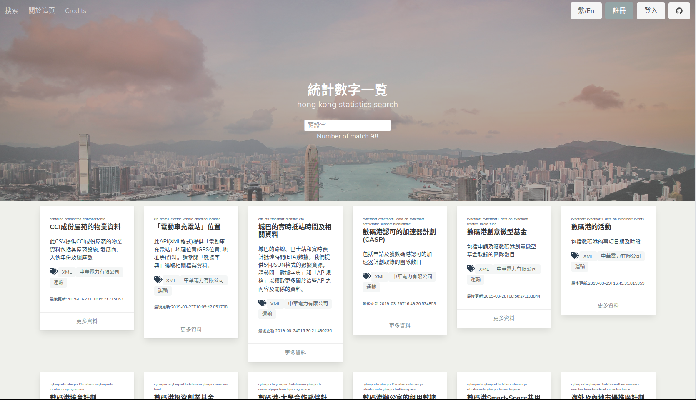



<---> <!-- magic separator, between columns -->

### Purpose:

A personal page to help search APIs provided by hk government. Also trying using gatsby.

### Demo:

[https://hk-data-search-8703a.web.app](https://hk-data-search-8703a.web.app)

### References / Repositories:

[louiscklaw/hk-data-search](louiscklaw/hk-data-search)
[https://travis-ci.com/github/louiscklaw/hk-data-search](https://travis-ci.com/github/louiscklaw/hk-data-search)


