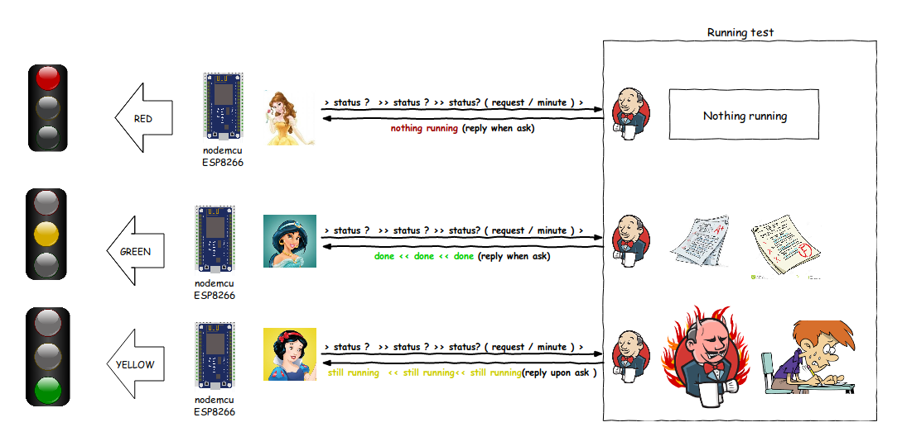



<---> <!-- magic separator, between columns -->

### Purpose:

This is a simple chatbot that help ask weather of hong kong. screenshot still preparing.
References / Repositories:

[louiscklaw/hko-weather-slackbot](louiscklaw/hko-weather-slackbot)
[slackapi/python-slackclient](slackapi/python-slackclient)

### reference:

[Weather Information in eXtensible Markup Language (XML)](http://demo.xml.weather.gov.hk/V2/index.html)


