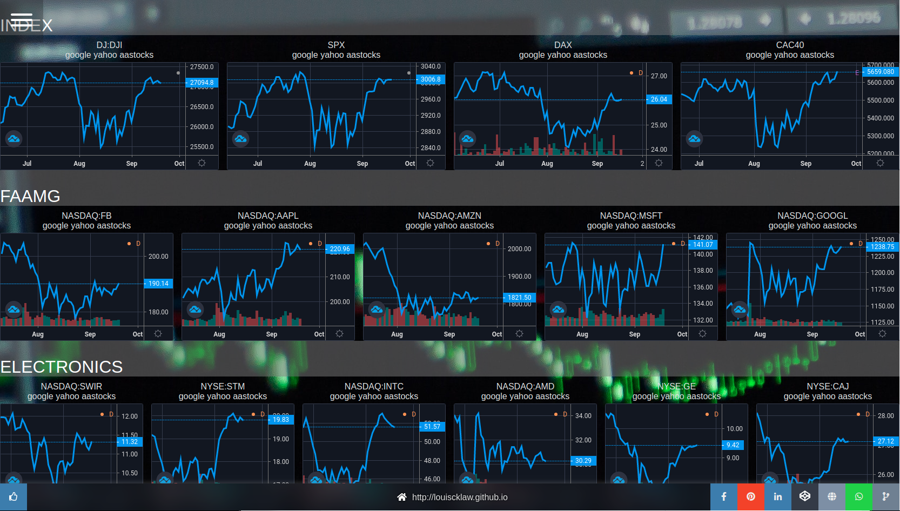



<---> <!-- magic separator, between columns -->

### Purpose:

A simple page to monitor stock, while data provided by trading view

### Demo:

[https://louiscklaw.github.io/tradingview-tile-tryout](https://louiscklaw.github.io/tradingview-tile-tryout)

### References / Repositories:

[louiscklaw/tradingview-tile-tryout](louiscklaw/tradingview-tile-tryout)


