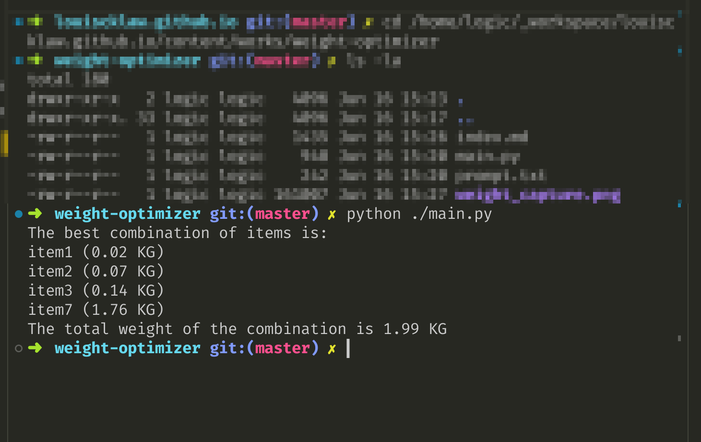

假設我有個集運有之下重量:


my prompt

```
i will input an array of weight of my goods

0.02 KG
0.07 KG
0.14 KG
0.2 KG
0.4 KG
0.54 KG
1.76 KG

show me the weight inputted

using python,
combine the weights,
such that the total weight is 1kg but not more than 1kg,
you can use more than one goods
```

```python
#!/usr/bin/env python

def select_items(weights):
    selected_items = []
    total_weight = 0

    for weight in sorted(weights, reverse=True):
        if total_weight + weight <= 1:
            selected_items.append(weight)
            total_weight += weight

    # Check if we are just below 1 kg and can add one more item
    remaining_weight = 1 - total_weight

    if remaining_weight > 0 and remaining_weight < min(weights):
        for weight in sorted(weights):
            if remaining_weight >= weight:
                selected_items.append(weight)
                remaining_weight -= weight
                total_weight += weight
                if total_weight == 1:
                    break

    return selected_items

weights = [0.02, 0.07, 0.14, 0.2, 0.4, 0.54, 1.76]
selected_items = select_items(weights)

print(selected_items)

print(sum(selected_items))
```



<a href="/">back to home</a>
