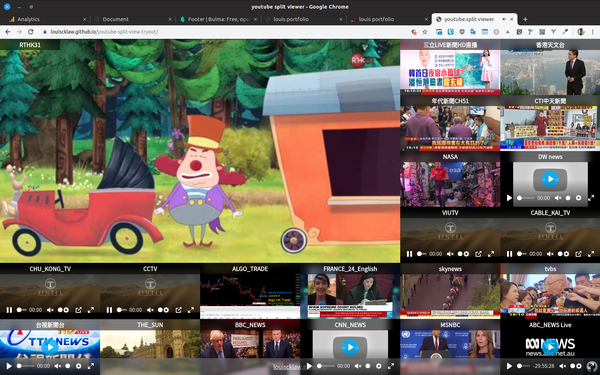



<---> <!-- magic separator, between columns -->

### Purpose:

this is a youtube/mpv viewer working in browser to let you monitor around 20 channel in same screen.
Status:

Currently revamping with gatsby

### POC demo:

[https://louiscklaw.github.io/youtube-split-view-tryout/](https://louiscklaw.github.io/youtube-split-view-tryout/)

### Demo:

### References / Repositories:

[louiscklaw/youtube-split-view-tryout](louiscklaw/youtube-split-view-tryout)

other youtube solution:

[http://afterglowplayer.com](http://afterglowplayer.com)


