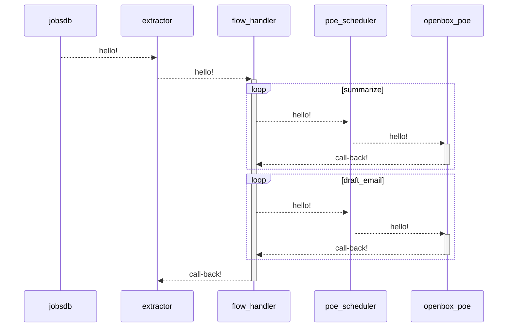

```mermaid
sequenceDiagram
    participant jobsdb
    participant extractor
    participant flow_handler
    participant poe_scheduler
    participant openbox_poe


    jobsdb-->>extractor: hello!
    extractor-->>+flow_handler: hello!

    loop summarize
        flow_handler-->>+poe_scheduler: hello!
        poe_scheduler-->>+openbox_poe: hello!
        openbox_poe-->>-flow_handler: call-back!
    end

    loop draft_email
        flow_handler-->>+poe_scheduler: hello!
        poe_scheduler-->>+openbox_poe: hello!
        openbox_poe-->>-flow_handler: call-back!
    end
    flow_handler-->>-extractor: call-back!
```

<!-- https://mermaid.js.org/syntax/sequenceDiagram.html -->