  

  (general block diagram)

### Purpose:

This page hold some appium source code from me.

### Practice:

Usually I test apps with android in the following way:

1. general app / WPA (HKO weather)

- test with android emulator (e.g. appium-android-12-tryout)

2. with specific hardware (handy)

- setup test stand

But most of the time i keep the host part inside docker, just like the block diagram above.

### Repository:

for some sample works about appium, please refer to:

<a href="https://github.com/louiscklaw/appium-playlist" target="_blank">
  https://github.com/louiscklaw/appium-playlist
</a>
