### Purpose:

This page holds some project screenshot of me

### Meny restaurant management panel (for mobile):

  

    <a  href="./images/mobile/mobile_001.jpg" data-lightbox="example-1">
      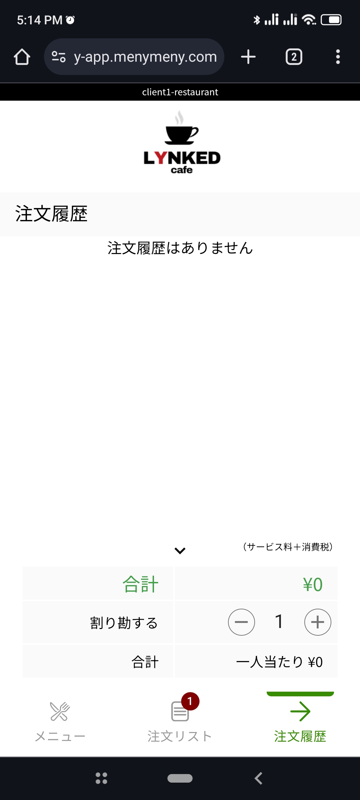
    </a>
  

  

    <a  href="./images/mobile/mobile_002.jpg" data-lightbox="example-1">
      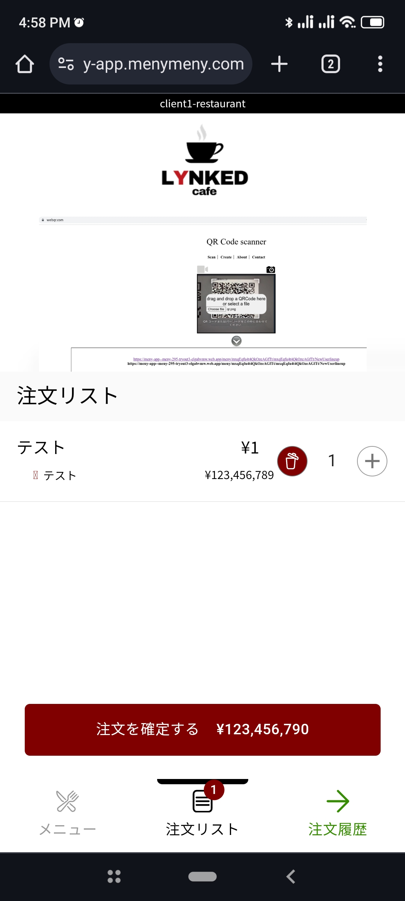
    </a>
  

  

    <a  href="./images/mobile/mobile_003.jpg" data-lightbox="example-1">
      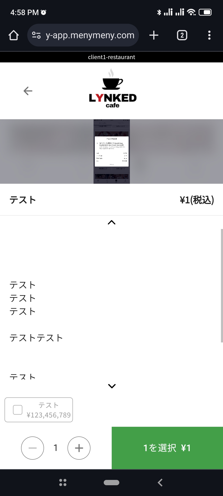
    </a>
  

  

    
  

  

    <a  href="./images/mobile/mobile_005.jpg" data-lightbox="example-1">
      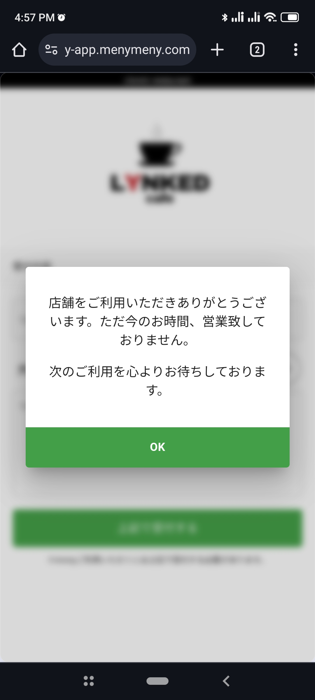
    </a>
  

  

    
  

### Meny restaurant management panel (for desktop / tablet):

  

    <a  href="./images/manage/manage_001.png" data-lightbox="example-1">
      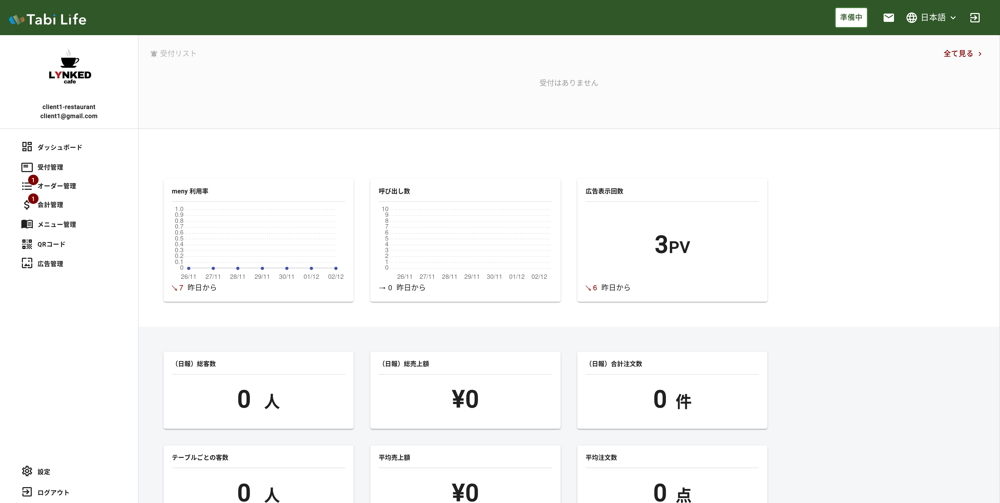
    </a>
  

  

    <a  href="./images/manage/manage_002.png" data-lightbox="example-1">
      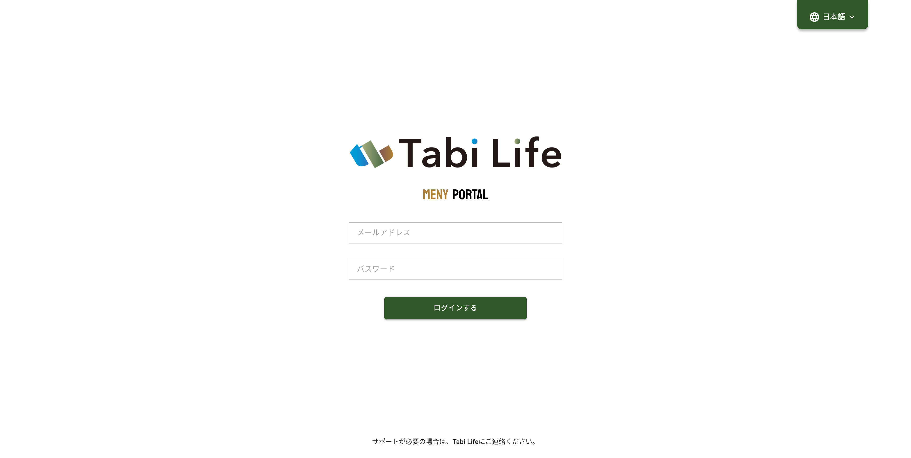
    </a>
  

  

    <a  href="./images/manage/manage_003.png" data-lightbox="example-1">
      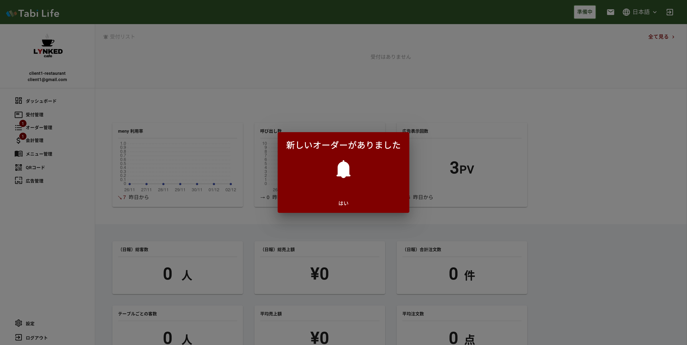
    </a>
  

  

    <a  href="./images/manage/manage_004.png" data-lightbox="example-1">
      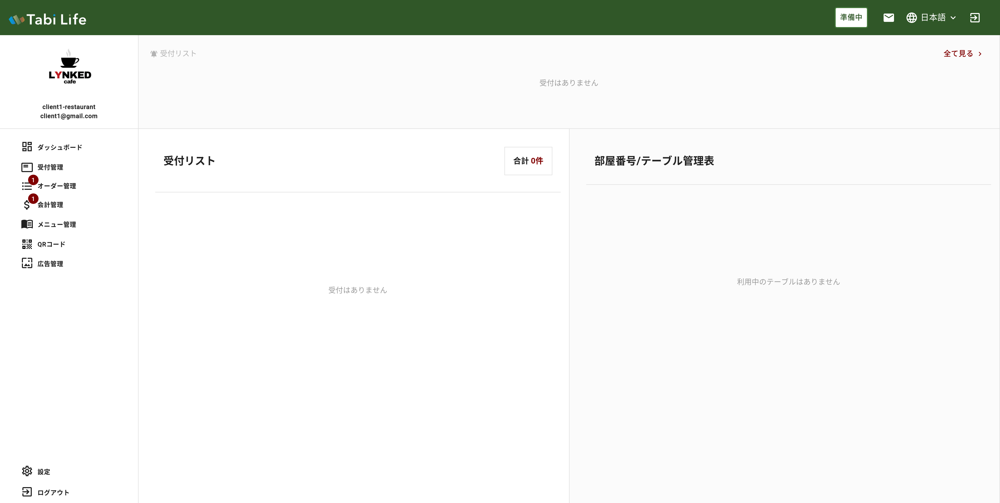
    </a>
  

  

    <a  href="./images/manage/manage_005.png" data-lightbox="example-1">
      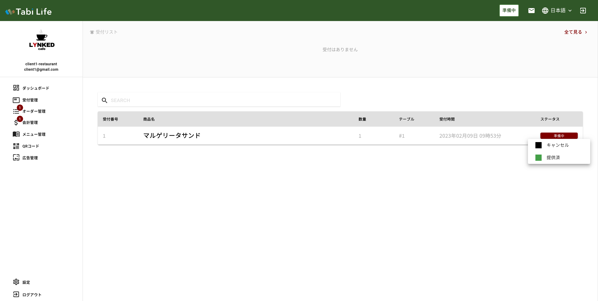
    </a>
  

  

    <a  href="./images/manage/manage_006.png" data-lightbox="example-1">
      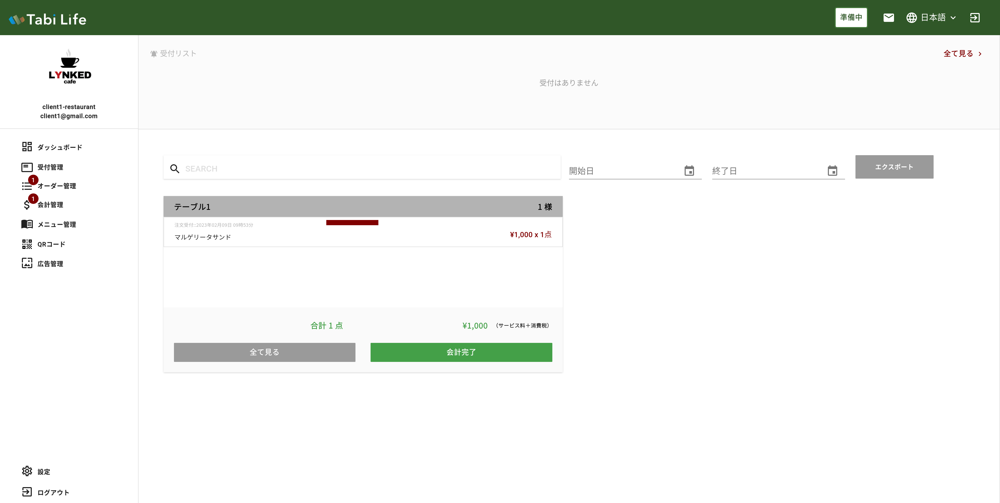
    </a>
  

  

    <a  href="./images/manage/manage_007.png" data-lightbox="example-1">
      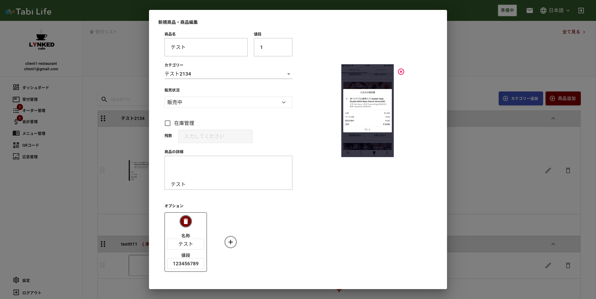
    </a>
  

  

    <a  href="./images/manage/manage_008.png" data-lightbox="example-1">
      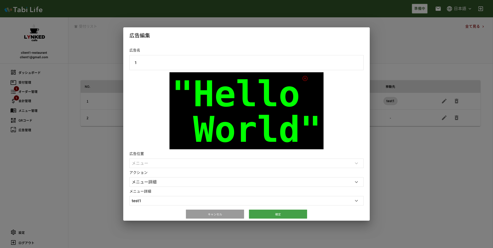
    </a>
  

  

    <a  href="./images/manage/manage_009.png" data-lightbox="example-1">
      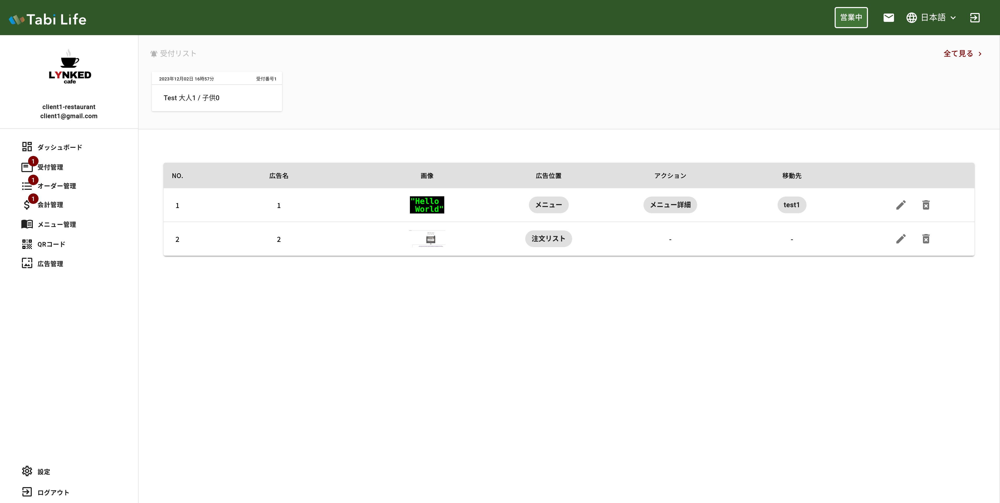
    </a>
  

  

    <a  href="./images/manage/manage_010.png" data-lightbox="example-1">
      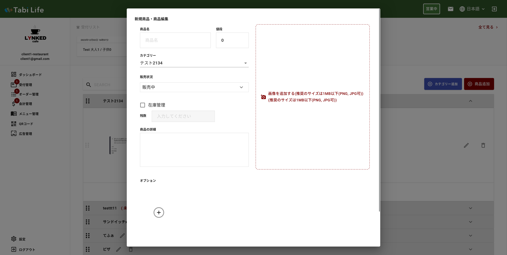
    </a>
  

  

    <a  href="./images/manage/manage_011.png" data-lightbox="example-1">
      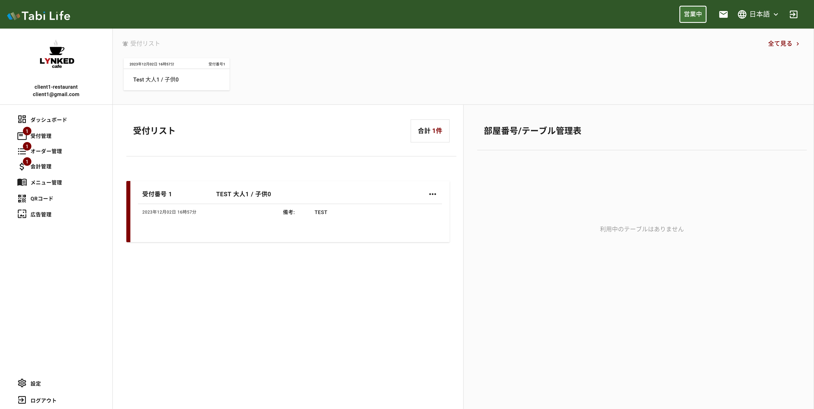
    </a>
  

  

    
  

