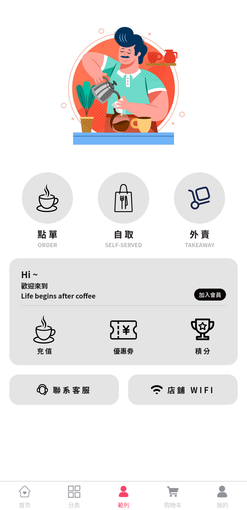
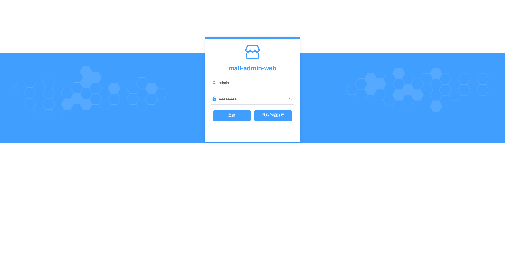
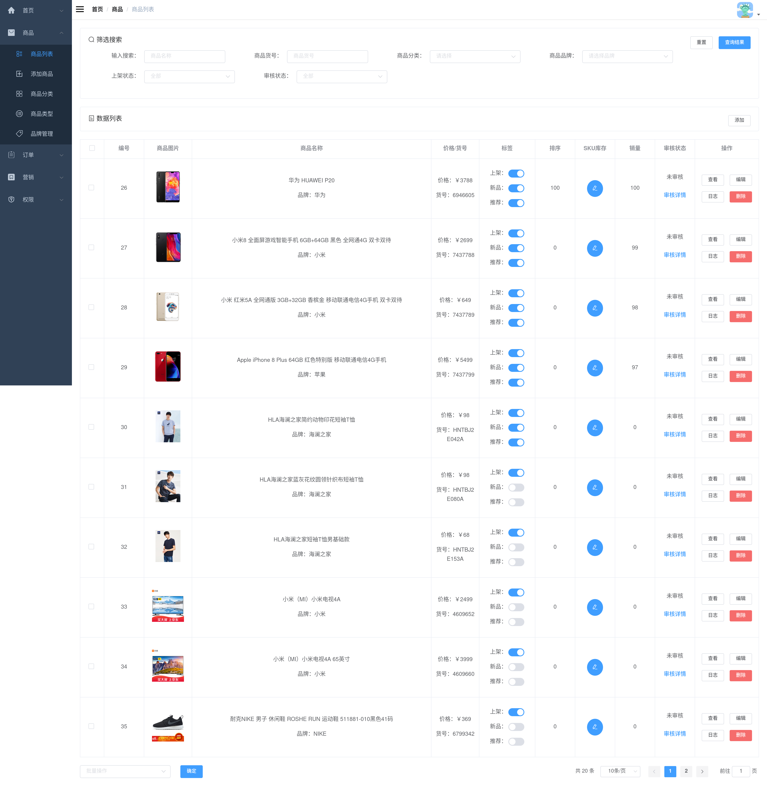
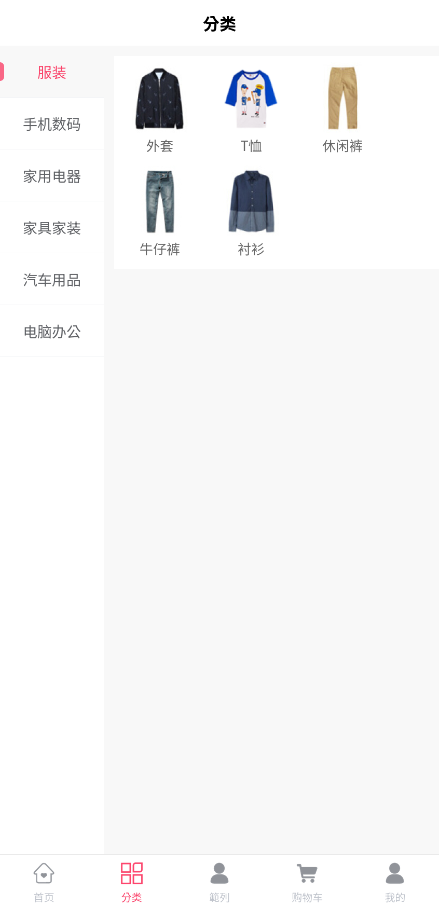
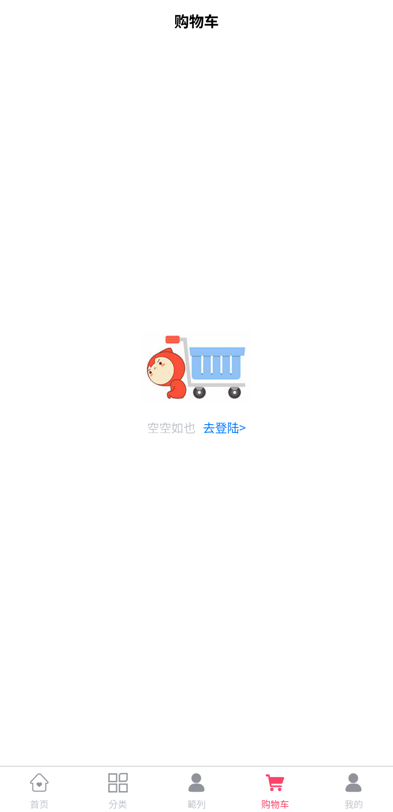
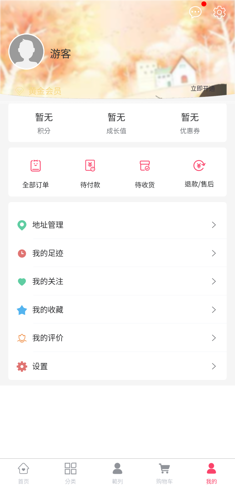

<!-- https://louiscklaw.github.io/works/project-uniapp -->

  

    
  

  

    
  

  

    
  

### Demo (sorry, not available yet)

- admin panel

  - http://localhost:8090
    - username: admin
    - password: macro123

- frontend/emall (mall-app-web)
  - username: kee
  - password: 123456

### Some screenshot (admin panel)

  

    
  

  

    
  

  

  

 

### Some screenshot (mobile)

  

    
  

  

    
  

  

    
  

  

    
  

### repository

- [original reporsitory from macrozheng](https://github.com/macrozheng/mall)
- [adopted to my docker configuration](https://github.com/louiscklaw/uniapp-playlist/tree/master/emall/macrozheng)

### Somee notes:

- H5Plus
- nvue
- renderjs
- native.js
- 时运行到iOS模拟器
- Android模拟器
- web
- 微信开发者工具 (not involved)
- 支付宝小程序Studio (not involved)
- 百度开发者工具 (not involved)
- 抖音开发者工具 (not involved)
- QQ开发者工具 (not involved)

### references:

- [https://zh.uniapp.dcloud.io/](https://zh.uniapp.dcloud.io/)
