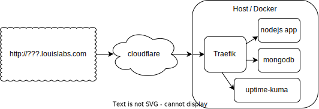

  (general block diagram)

### Purpose:

Traefik is a API router for use with docker.

This page hold my personal tryout and configuration for traefik API router. 

### Repository:

  <a href="https://github.com/louiscklaw/traefik-playlist" 
    target="_blank" rel="noopener noreferrer"
    aria-label="github repository link"
    > 
    https://github.com/louiscklaw/traefik-playlist
  </a>

