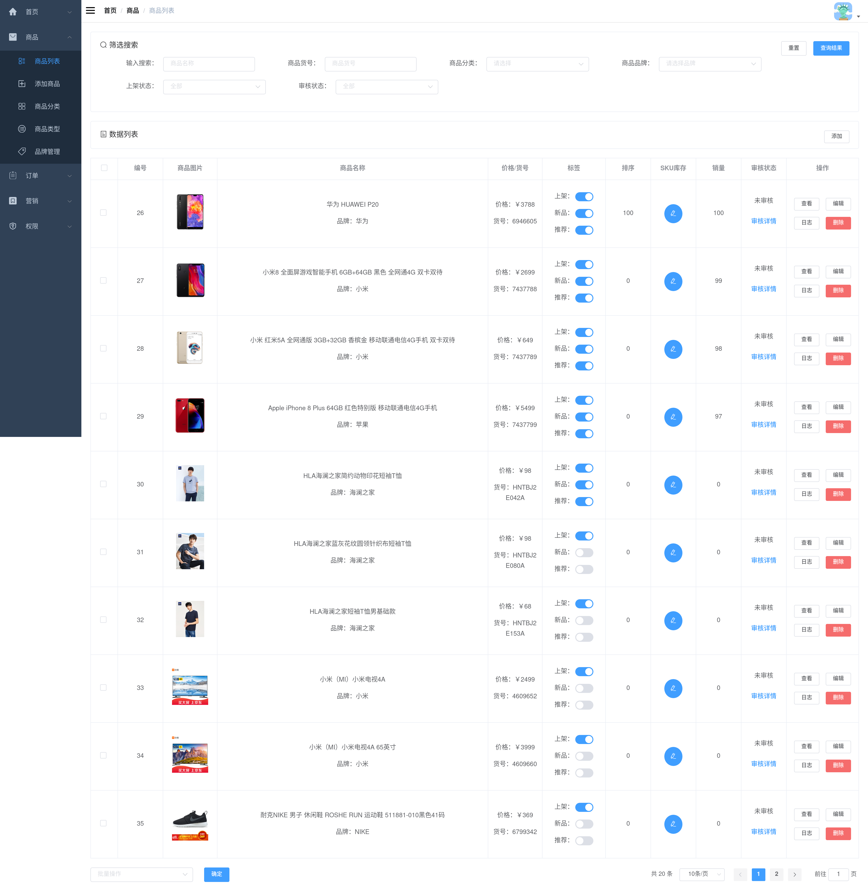
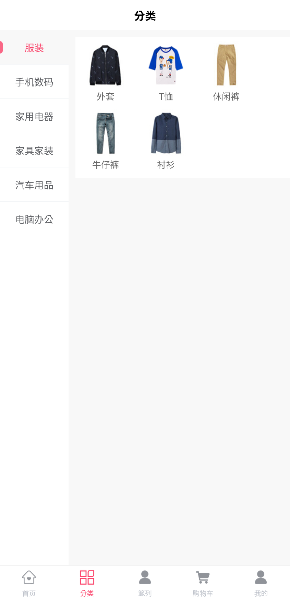
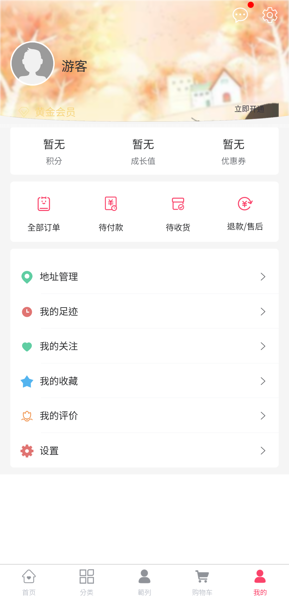

### Demo (not available yet)

- admin panel
  - http://localhost:8090
    - username: admin
    - password: macro123

- frontend/emall (mall-app-web)
    - username: kee
    - password: 123456

### Some screenshot

 

### repository

- [original reporsitory from macrozheng](https://github.com/macrozheng/mall)
- [adopted to my docker configuration](https://github.com/louiscklaw/uniapp-playlist/tree/master/emall/macrozheng)

### Somee notes:
  - H5Plus
  - nvue
  - renderjs
  - native.js
  - 时运行到iOS模拟器
  - Android模拟器
  - web
  - 微信开发者工具 (not involved)
  - 支付宝小程序Studio (not involved)
  - 百度开发者工具 (not involved)
  - 抖音开发者工具 (not involved)
  - QQ开发者工具 (not involved)

### references:
  - [https://zh.uniapp.dcloud.io/](https://zh.uniapp.dcloud.io/)
